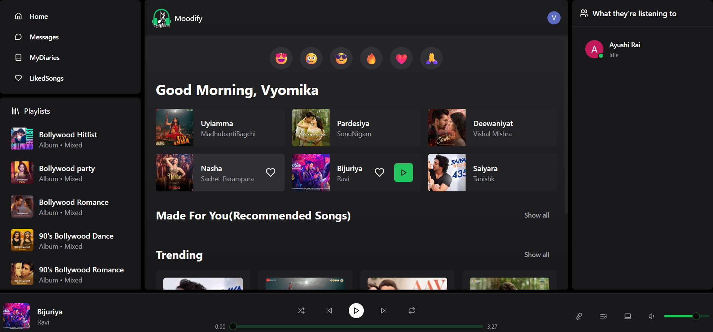
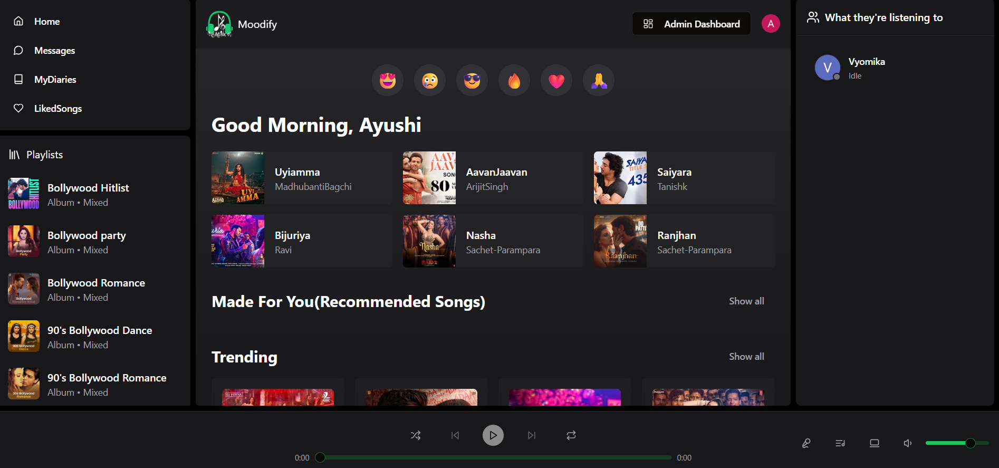
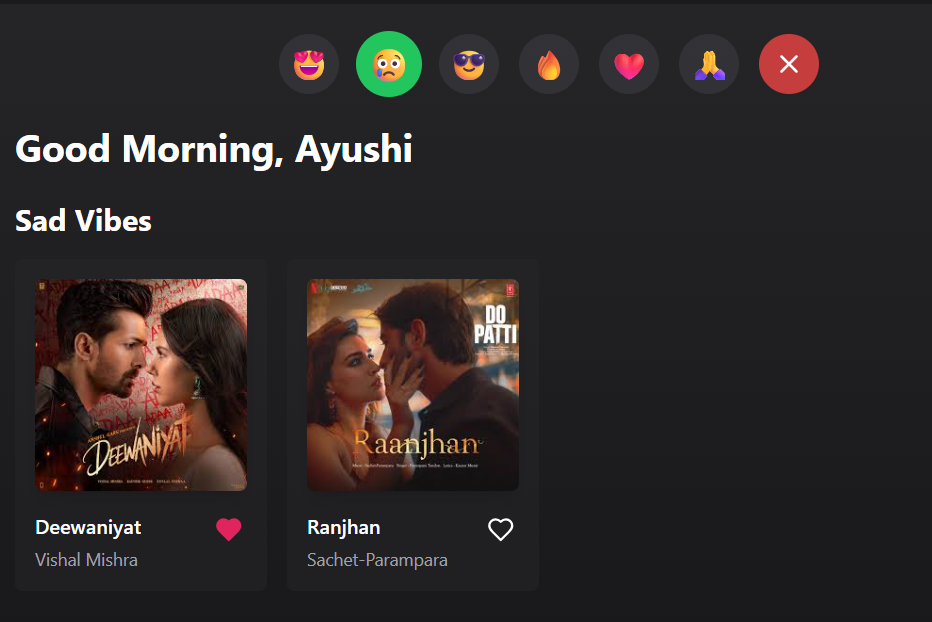
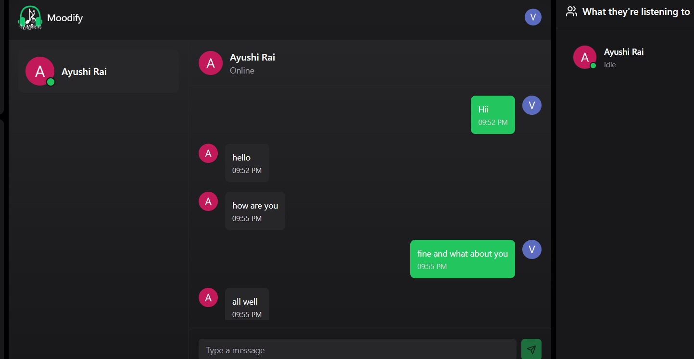
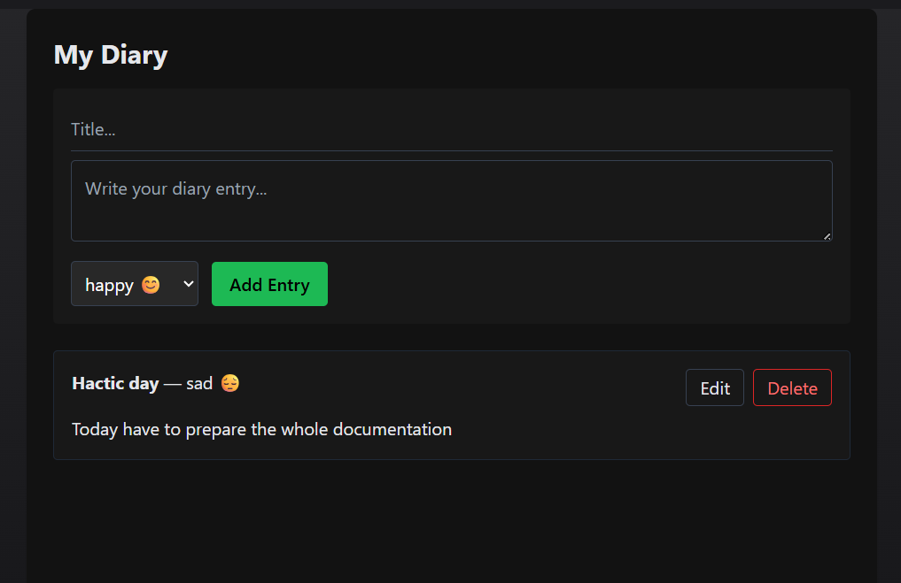

🎵 MOODIFY
A Mood-Centric Social Music Streaming Platform

Moodify is a full-stack music streaming web application designed to provide a personalized, socially interactive, and emotionally intelligent music experience.

Unlike traditional streaming platforms, Moodify blends:
🎧 Personalized recommendations
😊 Mood-based playlists
💬 Real-time chat
👀 Social listening
📖 Personal diary system
📊 Admin analytics dashboard
It transforms music from passive listening into a deeply engaging and social experience.

🚀 Features
👤 User Features
🔐 Secure Authentication
Powered by Clerk Authentication
Secure login, signup, and session management
Role-based access (User / Admin)

🎶 Music Player
Play / Pause
Next / Previous
Volume control slider
Seamless audio streaming

😊 Mood-Based Playlists
Curated playlists by mood:
Happy
Sad
Chill
Energetic
Romantic
Enhances emotional connection with music

🤖 Intelligent Recommendation System
Recommends songs based on:
Listening history
Most-played artist
Uses MongoDB aggregation for artist-based personalization

❤️ Like / Unlike Songs
Save favorite songs
Influences future recommendations
View all liked songs in a dedicated page

📖 Personal Diary System
Create diary entries
Associate mood with entries
Edit / Delete entries
Private and secure per user
Creates a musical memory timeline

💬 Real-Time Chat
Built using Socket.IO
One-to-one messaging
Online / Offline user status
Instant message broadcasting

👀 Social Listening
View what other users are currently listening to
Real-time listening activity updates
👨‍💼 Admin Features
📂 Content Management System (CMS)

Add new albums
Upload songs
Assign mood to songs
Delete albums and songs
Cloudinary-based media upload

📊 Analytics Dashboard
Displays aggregated platform statistics:
Total number of users
Total number of albums
Total number of songs
Total number of artists
Provides strategic insights into platform growth.

🏗️ System Architecture
Moodify follows a Full-Stack MERN Architecture with real-time extensions.
Frontend:
React.js
TypeScript
Tailwind CSS
ShadCN UI
Zustand (State Management)
Clerk React
Axios
Backend:
Node.js
Express.js
MongoDB
Mongoose
Socket.IO
Clerk Middleware
Express File Upload
Cloud Services
Cloudinary (Media storage & CDN delivery)
Clerk (Authentication & user management)

🏠 Home / Dashboard

🎵 Music Player

😊 Emoji-Based Playlists

💬 Real-Time Chat

📖 Personal Diary

👨‍💼 Admin Dashboard

Real-Time Listening Activity
